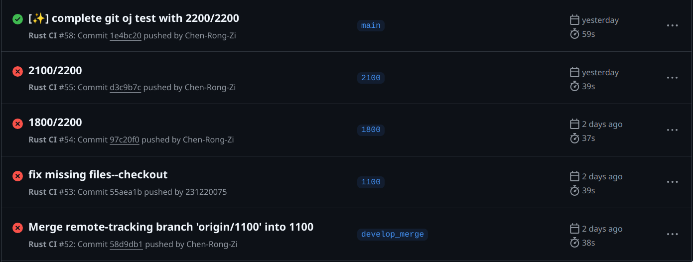

# 项目实验报告

## 1. 项目选题
**项目名称**: 使用 Rust 实现轻量级 Git  
**项目简介**: 本项目旨在使用 Rust 实现一个轻量级的 Git 系统，支持基本的版本控制功能，包括分支管理、文件跟踪、提交、合并等操作。

---

## 2. 小组成员信息
| 姓名   | 学号       | 分工                     |
|--------|------------|--------------------------|
| 陈翔宇   | 231220088   | 项目架构设计、代码实现、编写测试   |
| 黄睿智   | 231220075   | 代码实现、辅助测试、暑期填坑（远程分支管理）     |


---

## 3. 项目需求
1. 支持基本的 Git 功能：
   - 初始化仓库（`init`）
   - 添加文件到索引（`add`）
   - 提交更改（`commit`）
   - 分支管理（`branch`、`checkout`）
   - 合并分支（`merge`）
2. 支持底层 Git 命令：
   - 修改暂存区（`update-index`、`read-tree`）
   - 生成基础的 Git 对象（`write-tree`、`commit-tree`、`hash-object`）
   - 修改分支引用（`update-ref`、`symbolic-ref`）
   - 监看 Git 对象（`cat-file`）
3. 提供命令行工具，用户可以通过命令行操作仓库。
4. 支持冲突检测，供使用者抉择。

---

## 4. 整体架构设计
### 4.1 模块划分
- **命令模块**: 处理用户输入的命令（如 `add`、`commit`、`merge`等）。
- **对象存储模块**: 负责存储和读取 Git 对象（如 `blob`、`tree`、`commit`）。
- **索引模块**: 管理暂存区（`index`）。
- **分支与引用模块**: 管理分支和 `HEAD` 指针。
- **文件系统模块**: 处理文件的读写操作。

### 4.2 流程图


## 5. 功能实现

### 5.1 基础版本控制功能

- **提交更改（commit）**:
    组织 index 的条目构建 tree object，得到 tree_hash，读取当前分支的最新提交作为 parent commit， 加上 author 、email 和 commit_message 作为 commmit object 的内容，然后 hash 得到commit hash，更新当前分支的ref，输出commit hash。

- **分支管理（branch）**:
    1. 无参数直接遍历 .git/refs/heads 中的文件输出当前所有分支，并比对当前 HEAD 指向的分支来标明当前分支
    2. 只加 branch_name 在 .git/refs/heads 下创建文件 branch_name，并写入当前分支的 commit hash。
    3. 加 delete 参数，目前是强制删除分支，保证不是删除当前所在分支的前提下移除 .git/refs/heads 下对应的文件。

- **分支切换和文件恢复（checkout）**:
1. 分支切换：


2. 文件恢复：
    若指定 commit hash 或 “HEAD”，获得 tree hash 从 tree content 中恢复指定文件，并修改 index 中该文件的对应条目；否则若 index 中有该文件条目，从 index 区恢复；否则失败。

- 暂存区的添加与删除


- 分支合并
1. fast-forward


2. 三路合并(其实实际上实现为了二路合并)


- just for fun

shell中的git仓库的提示到底是什么意思


| ---              | 工作区与暂存区相同 | 缺少文件       | 工作区因为修改文件 | 工作区因为添加文件   |
| ---              | ---                | ---            | ---                | ---                  |
| 暂存区和仓库相同 | 收敛状态(蓝色)     | 修改状态(紫色) | 修改状态(紫色)     | 有未追踪的文件(红色) |
| 暂存区和仓库不同 | 准备提交阶段(青色) | 修改状态(紫色) | 修改状态(紫色)     | 有未追踪的文件(红色) |


### 5.2 远程操作功能

#### 5.2.1 网络协议实现

我们实现了完整的 Git 网络协议栈，支持与 GitHub 等远程仓库的交互：


**核心库使用**：
- `reqwest`: HTTP 客户端，支持认证和自定义头部
- `sha1`: SHA-1 哈希计算，用于对象校验和 packfile 校验
- `flate2`: zlib 压缩，Git 对象存储格式
- `hex`: 十六进制编码/解码

#### 5.2.2 Git Packfile 格式实现

Packfile 是 Git 的核心二进制格式，用于高效存储和传输多个对象：


**对象头部编码**（变长编码）：
```rust
// 第一字节: [继续位][类型3位][大小4位]
// 后续字节: [继续位][大小7位]
let first_byte = (obj_type << 4) | (size & 0x0F);
if size > 0x0F { first_byte |= 0x80; } // 设置继续位
```

#### 5.2.3 推送操作（Push）

推送是最复杂的远程操作，涉及对象收集、packfile 创建和网络传输：


**对象依赖收集算法**：
```rust
fn collect_objects_recursively() {
    // 1. 从 commit 开始
    visited.insert(commit_hash);
    objects.push(commit_hash);
    
    // 2. 收集 tree 对象
    for tree_hash in commit.trees {
        collect_tree_objects(tree_hash);
    }
}

fn collect_tree_objects(tree_hash) {
    // 3. 递归收集子树和文件
    for entry in tree.entries {
        if entry.mode == "040000" { // 目录
            collect_tree_objects(entry.hash);
        } else { // 文件
            objects.push(entry.hash); // blob
        }
    }
}
```

#### 5.2.4 拉取操作（Pull & Fetch）

实现了完整的 pull 和 fetch 功能，支持 packfile 解析：


**packfile 解析流程**：


#### 5.2.5 pkt-line 协议实现

Git 使用 pkt-line 协议进行网络通信：


**解析示例**：
```rust
// 输入: "003fhello world\n"
// 长度: 0x003f = 63 字节
// 内容: "hello world\n" (63-4=59 字节)

fn parse_pkt_line(line: &str) -> Option<String> {
    let length = u16::from_str_radix(&line[..4], 16)?;
    if length == 0 { return Some(String::new()); }
    
    let content_length = (length as usize) - 4;
    Some(line[4..4 + content_length].to_string())
}
```

#### 5.2.6 认证机制

支持 GitHub Personal Access Token 认证：


**实现细节**：
```rust
// 环境变量优先级
1. GITHUB_TOKEN + GITHUB_USER
2. 交互式输入
3. request.basic_auth(username, token)
```

#### 5.2.7 错误处理和调试

实现了详细的错误处理和调试信息：

- **网络错误**: HTTP 状态码、响应体解析
- **协议错误**: pkt-line 格式验证、引用解析失败  
- **packfile 错误**: 校验和不匹配、对象格式错误
- **认证错误**: Token 无效、权限不足

**调试功能**：
```rust
if verbose {
    println!("Packfile debug:");
    println!("  Size: {} bytes", packfile.len());
    println!("  Objects: {}", object_count);
    println!("  SHA-1: {}", checksum_hex);
}
```

### 5.3 技术特色

1. **纯 Rust 实现**: 不依赖系统 Git，完全自实现
2. **完整协议支持**: 支持 Git Smart Protocol 和 pkt-line
3. **高效 packfile**: 二进制格式，压缩存储，校验完整性
4. **递归对象收集**: 自动处理复杂的对象依赖关系
5. **详细错误信息**: 便于调试和问题定位

## 6. 测试和工作流

```yml
name: Rust CI

# 触发条件：当代码推送到仓库或创建 Pull Request 时触发
on:
  push:
    branches: [ '**' ]

jobs:
  build-and-test:
    runs-on: ubuntu-latest  # 使用最新的 Ubuntu 环境

    steps:
      # Step 1: 检出代码
      - name: Checkout code
        uses: actions/checkout@v3

      # Step 2: 设置 Rust 工具链
      - name: Set up Rust
        uses: actions-rs/toolchain@v1
        with:
          toolchain: stable  # 使用稳定的 Rust 工具链

      # Step 3: 运行 cargo test
      - name: Run Tests
        run: cargo test -- --test-threads=1

      # Step 4: 运行 cargo clippy 检查
      - name: Run Clippy
        run: cargo clippy -- -D warnings  # 将警告视为错误

      # （可选）Step 5: 构建项目
      - name: Build Project
        run: cargo build --release
```





## 7.问题总结
1. 最初实现 checkout 的时候对其功能认知有偏差，以为切换分支和恢复文件相耦合，后来在队友的提醒下增加了单独恢复文件/目录的逻辑。
2. checkout 切换分支的实现是用目标分支的文件树覆盖 index 区，并修改工作区。但如果当前分支的 index 追踪了目标分支不存在的文件A，切换分支后会多出A，所以在切换前应该删除工作区中所有被暂存在 index 区中的文件，然后再把目标分支的文件树覆盖 index 区和写入工作区。
3. 起初对 index 区和tree object 的认识比较浅薄。实际上 index 区的每个条目存储的是完整的路径
而不是像 tree object 一样是递归存储的。这一点不同导致在 checkout 恢复文件的时候出现了一些问题，诸如直接拿 index 存储的 path 去创建文件，实际要先 create_dir_all(path.parent()) 确保父目录存在，否则会创建失败。


## 8.项目总结
- **收获**:
    - 深入了解了 Git 的内部实现原理和细节。
    - 加深了对 rust 所有权机制、问题处理和特型等的理解，在队长的带领下提升了团队协作能力和 rust 编程能力。

- **不足**:
    - 只实现了基本功能，原计划的远程操作功能未能完成。希望课程结束后继续完善，暑期优化一下。(已填坑 qwq)
    - 在写出该质量代码的目标上还有很远的路要走。

## 写在最后
- 总的来说只是粗略复刻了git的部分功能，实际上git还有很多强大的功能，是我在开始这个项目之前没有用过、了解过的。加上暑假，前前后后应该是三个月左右，（中间鸽了很长时间），不过至少把坑填上了qwq。
- 当然这个版本可能还有没发现的bug，如果有人看到、使用并发现了某处有问题，欢迎来找我们反馈：231220075@smail.nju.edu.cn。（不过真的有人看吗o_O）
- 走过路过点个star（bushi）
- 2025.8.6 初版完结纪念

- 2025.12.5 test gpg status